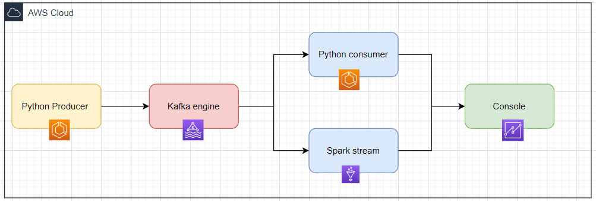

# Kafka-to-Spark Streaming via Docker

Utilize o poder do streaming entre Kafka e Spark através de containers Docker. Não requer instalações além do Docker e do Docker-compose.



## Resumo

- **Facilidade**: Execute tudo através de um único comando.
- **Arquitetura**: Um `docker-compose` levanta clusters Kafka e Spark, já conectados.
- **Produção**: Envie mensagens para o tópico Kafka "test-topic".
- **Consumo**: Leia mensagens via scripts Python ou utilize o streaming Spark para visualização no console.

> ⚠️ **Nota**: Streaming via Spark suporta apenas Scala atualmente. Versão Python em desenvolvimento.

## Pré-requisitos

1. [Docker](https://docs.docker.com/engine/install/ubuntu/) (>= 19.X.X) e Docker Compose (~1.29.2)
2. Privilégios de root.
3. Certifique-se que a porta `8080` e a sub-rede `172.18.0.0/24` estão livres.

## Estrutura de Diretórios

```
.
├── architecture.png           # Visão da arquitetura
├── clean-env.sh               # Limpa o ambiente
├── docker-compose.yml         # Levanta clusters Kafka e Spark
├── python-consumer            # Scripts para consumo do Kafka
│ ├── consumidor.py
│ └── Dockerfile
├── python-producer            # Scripts para produção no Kafka
│ ├── produtor.py
│ └── Dockerfile
└── spark-streaming            # Scripts para streaming Kafka-to-Spark
      ├── python               # Em desenvolvimento
      └── scala                # Em desenvolvimento
```

## Serviços e Endereços

- **Kafka**: `172.18.0.9:9093` (host) / `172.18.0.9:9092` (container)
- **Spark Master**: `172.18.0.10:7077`
- **Spark UI**: `172.18.0.10:8080`
- ... (outros serviços omitidos para brevidade)

> **Nota**: O projeto usa a rede Docker "kafka-spark" no range `172.18.0.0/24`.

## Passo-a-Passo

1. **Configuração Inicial**

   ```bash
   git clone https://github.com/TASIO852/Dados-em-streaming.git
   cd kafka-spark-streaming-docker/
   ```

2. **Execute os Containers**

   ```bash
   docker-compose up
   ```

3. **Inicie o Streaming do Spark**

   ```bash
   sudo chmod 777 jars_dir && \
   docker exec -it spark \
   submit spark \
   --packages "org.apache.spark:spark-sql-kafka-0-10_2.12:3.2.0" \
   --master "spark://172.18.0.10:7077" \
   --class Transmissão \
   --conf spark.jars.ivy=/opt/bitnami/spark/ivy \
   ivy/spark-streaming-with-kafka_2.12-1.0.jar
   ```

## Monitoramento

Acesse a [IU do Spark](http://172.18.0.10:8080) ou visualize os logs via:

```bash
docker-compose logs -f [SERVICE_NAME]
```

## Próximos Passos

- Implementação com Terraform.
- Deploy na AWS.

---
